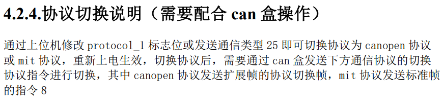

# 灵足电机RS05

## 通信协议分为三种：私有协议，canopen协议，mit协议（默认为私有协议，可通过上位机写参数或发命令切换）

我们一般使用mit协议，因为另外两种协议都是扩展帧的can
注意：mit协议下上位机无法检测到电机，故应在上位机上或用私有协议配置好电机后再切换到mit协议

各个电机模式是基于不同协议而言的，mit协议下有mit模式即：运控模式（上电默认）、速度模式、位置模式（CSP）

电机为应答式反馈，注：电机虽然有主动上报功能（默认关闭），但上报频率最高才100Hz，且需要提前通过私有协议更改

- 默认反馈角度：-4π~4π rad    顺时针为正（正视转子）
- 默认反馈速度：-50~50 rad/s
- 默认反馈力矩：-5.5~5.5 N.m
